<picture>
  <source media="(prefers-color-scheme: dark)" srcset="assets/banner-dark.svg">
  <source media="(prefers-color-scheme: light)" srcset="assets/banner-light.svg">
  
</picture>

I build systems that move money, and products that move people.

Senior backend engineer and tech lead in Tel Aviv. I've spent 5+ years building and operating distributed systems in production, I build developer tooling around AI, and I co-founded and build [Snapick](https://snapick-ai.com/).

```java
public class Matan implements BackendEngineer, Founder {
    Focus focus = Focus.of(
        DISTRIBUTED_SYSTEMS, INFRASTRUCTURE, AI_DEV_TOOLING);
    boolean usesAiToCode() { return true; } // and I read it
}
```

## Production systems

Most of my production experience is financial infrastructure: payments, SWIFT, and high-throughput messaging at millions of requests per minute. I lead backend work and stay hands-on in architecture, reliability and operations.

Day to day that's Java and Spring Boot on AWS, with Kafka, RabbitMQ, Redis and PostgreSQL.

## AI code review

I led the development of an AI-powered code review system used across hundreds of developers, reviewing 10,000+ pull requests a month. It's internal to my employer, so the code isn't public.

I also use AI coding tools heavily in my own work, and I'm most interested in the practical side of them: making them reliable and useful to the engineers who have to review their output.

## Snapick

[Snapick](https://snapick-ai.com/) is an event-photo platform: it uses face recognition to give each guest a personal gallery of the photos they appear in. I co-founded it, build it hands-on across backend, infrastructure and product, and operate it in production.

## Public work

Most of my work is in private repositories. What is public:

- [**spring-failure-lab**](https://github.com/MatanElbaz/spring-failure-lab): reproduce backend failures on Spring Boot and Kafka with one command. Each scenario has a test that shows the failure and a test that shows the fix. Early: one scenario so far.
- [**backend-skills**](https://github.com/MatanElbaz/backend-skills): five Claude Code skills that check backend code against common production failure modes: idempotency, transaction boundaries, timeouts and retries, safe migrations, money handling.
- [**1Z0-808**](https://github.com/MatanElbaz/1Z0-808): an older project, a free Q&A guide for the Oracle Java SE 8 Programmer I exam.
